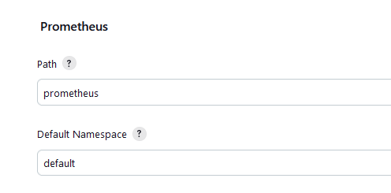

# Metrics collected by [prometheus-plugin](../../README.md)

Metrics collected by this Plugin are prefixed with "default_jenkins".
You can change the "default" prefix either via configuration page (Default Namespace):



or an environment variable ```PROMETHEUS_NAMESPACE```.
If the environment variable is defined this value will be taken.

## DiskUsageCollector

Required Plugin:
[cloudbees-disk-usage-simple-plugin](https://github.com/jenkinsci/cloudbees-disk-usage-simple-plugin)

| metric                                     | description                                                  | Prometheus Type |
|--------------------------------------------|--------------------------------------------------------------|-----------------|
| default_jenkins_disk_usage_bytes           | Disk usage of first level folder in JENKINS_HOME in bytes    | gauge           |
| default_jenkins_job_usage_bytes            | Amount of disk usage for each job in Jenkins in bytes        | gauge           |
| default_jenkins_file_store_capacity_bytes  | Total size in bytes of the file stores used by Jenkins       | gauge           |
| default_jenkins_file_store_available_bytes | Estimated available space on the file stores used by Jenkins | gauge           |

## ExecutorCollector

| metric                                 | description                                                     | Prometheus Type |
|----------------------------------------|-----------------------------------------------------------------|-----------------|
| default_jenkins_executors_available    | Shows how many Jenkins Executors are available                  | gauge           |
| default_jenkins_executors_busy         | Shows how many Jenkins Executors busy                           | gauge           |
| default_jenkins_executors_connecting   | Shows how many Jenkins Executors are connecting                 | gauge           |
| default_jenkins_executors_defined      | Shows how many Jenkins Executors are defined                    | gauge           |
| default_jenkins_executors_idle         | Shows how many Jenkins Executors are idle                       | gauge           |
| default_jenkins_executors_online       | Shows how many Jenkins Executors are online                     | gauge           |
| default_jenkins_executors_queue_length | Shows number of items that can run but waiting on free executor | gauge           |

## JenkinsStatusCollector

| metric                       | description                                | Prometheus Type |
|------------------------------|--------------------------------------------|-----------------|
| default_jenkins_version      | Shows the jenkins Version                  | info            |
| default_jenkins_up           | Shows if jenkins ready to receive requests | gauge           |
| default_jenkins_uptime       | Shows time since Jenkins was initialized   | gauge           |
| default_jenkins_nodes_online | Shows Nodes online status                  | gauge           |
| default_jenkins_quietdown    | Shows if jenkins is in quiet mode          | gauge           |

## JobCollector

The JobCollector provides metrics about the Job and build specific metrics.

| metric                                                     | description                                                               | Prometheus Type |
|------------------------------------------------------------|---------------------------------------------------------------------------|-----------------|
| default_jenkins_builds_duration_milliseconds_summary       | Summary of Jenkins build times in milliseconds by Job                     | summary         |
| default_jenkins_builds_success_build_count                 | Successful build count                                                    | counter         |
| default_jenkins_builds_failed_build_count                  | Failed build count                                                        | counter         |
| default_jenkins_builds_unstable_build_count                | Unstable build count                                                      | counter         |
| default_jenkins_builds_total_build_count                   | Total build count (excluding not_built statuses)                          | counter         |
| default_jenkins_builds_aborted_build_count                 | Aborted build count                                                       | counter         |
| default_jenkins_builds_health_score                        | Health score of a job                                                     | gauge           |
| default_jenkins_builds_available_builds_count              | Gauge which indicates how many builds are available for the given job     | gauge           |
| default_jenkins_builds_discard_active                      | Gauge which indicates if the build discard feature is active for the job. | gauge           |
| default_jenkins_builds_running_build_duration_milliseconds | Gauge which indicates the runtime of the current build.                   | gauge           |

There are additional build specific metrics returning stats for the last build of a job if you don't enable build
specific metrics over the configuration page:

| metric                                                          | description                                                                                                                                                                   | Prometheus Type |
|-----------------------------------------------------------------|-------------------------------------------------------------------------------------------------------------------------------------------------------------------------------|-----------------|
| default_jenkins_builds_last_build_result_ordinal                | Build status of a job (last build) (0=SUCCESS,1=UNSTABLE,2=FAILURE,3=NOT_BUILT,4=ABORTED)                                                                                     | gauge           |
| default_jenkins_builds_last_build_result                        | Build status of a job as a boolean value (1 or 0). &lt;br/&gt;Where 1 stands for the build status SUCCESS or UNSTABLE and 0 for the build states FAILURE,NOT_BUILT or ABORTED | gauge           |
| default_jenkins_builds_last_build_duration_milliseconds         | Build times in milliseconds of last build                                                                                                                                     | gauge           |
| default_jenkins_builds_last_build_start_time_milliseconds       | Last build start timestamp in milliseconds                                                                                                                                    | gauge           |
| default_jenkins_builds_last_build_tests_total                   | Number of total tests during the last build                                                                                                                                   | gauge           |
| default_jenkins_builds_last_last_build_tests_skipped            | Number of skipped tests during the last build                                                                                                                                 | gauge           |
| default_jenkins_builds_last_build_tests_failing                 | Number of failing tests during the last build                                                                                                                                 | gauge           |
| default_jenkins_builds_last_stage_duration_milliseconds_summary | Summary of Jenkins build times by Job and Stage in the last build                                                                                                             | summary         | 
| default_jenkins_builds_last_logfile_size_bytes                  | Gauge which shows the log file size in bytes.                                                                                                                                 | gauge           |

If you enable the per build metrics, there will be additional metrics for every build, additionally to the metrics for
the `last_build`. They will be created for every build available in the UI so be careful if you have many jobs with many
builds. The metrics will have a new label called `number` containing the build number of the given build.


| metric                                                     | description                                                                                                                                                                   | Prometheus Type |
|------------------------------------------------------------|-------------------------------------------------------------------------------------------------------------------------------------------------------------------------------|-----------------|
| default_jenkins_builds_build_result_ordinal                | Build status of a job (last build) (0=SUCCESS,1=UNSTABLE,2=FAILURE,3=NOT_BUILT,4=ABORTED)                                                                                     | gauge           |
| default_jenkins_builds_build_result                        | Build status of a job as a boolean value (1 or 0). &lt;br/&gt;Where 1 stands for the build status SUCCESS or UNSTABLE and 0 for the build states FAILURE,NOT_BUILT or ABORTED | gauge           |
| default_jenkins_builds_build_duration_milliseconds         | Build times in milliseconds of last build                                                                                                                                     | gauge           |
| default_jenkins_builds_build_start_time_milliseconds       | Last build start timestamp in milliseconds                                                                                                                                    | gauge           |
| default_jenkins_builds_build_tests_total                   | Number of total tests during the last build                                                                                                                                   | gauge           |
| default_jenkins_builds_build_tests_skipped                 | Number of skipped tests during the last build                                                                                                                                 | gauge           |
| default_jenkins_builds_build_tests_failing                 | Number of failing tests during the last build                                                                                                                                 | gauge           |
| default_jenkins_builds_stage_duration_milliseconds_summary | Summary of Jenkins build times by Job and Stage in the last build                                                                                                             | summary         | 
| default_jenkins_builds_logfile_size_bytes                  | Gauge which shows the log file size in bytes.                                                                                                                                 | gauge           |
